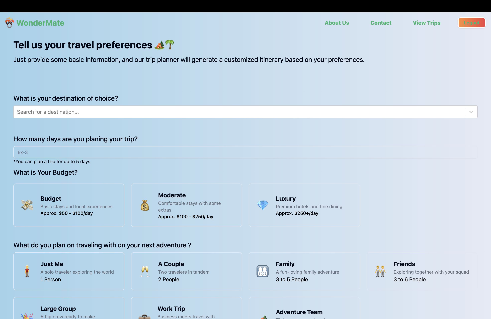
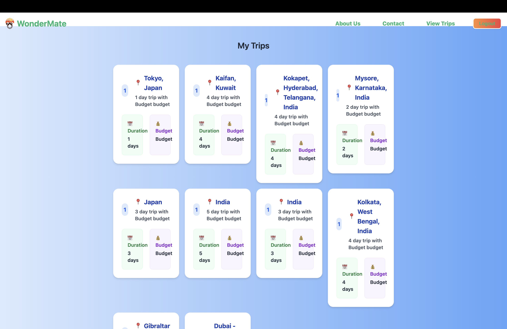
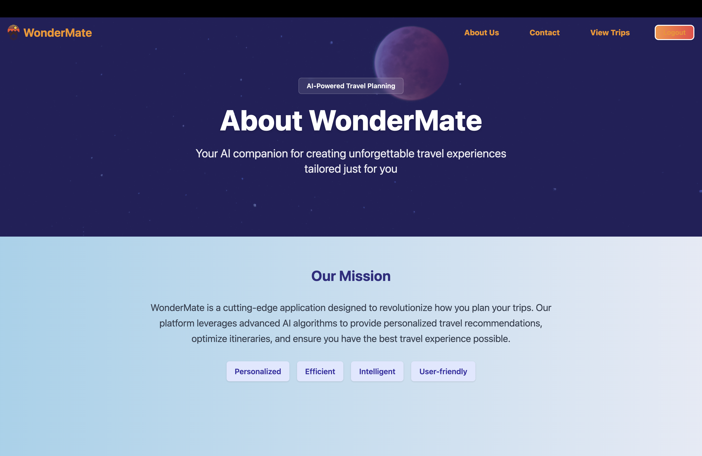

# WonderMate - AI Trip Planner

WonderMate is a cutting-edge application designed to help you plan your trips with ease and efficiency. Our platform leverages advanced AI algorithms to provide personalized travel recommendations, optimize itineraries, and ensure you have the best travel experience possible.

## Website Preview

  
*A glimpse of the WonderMate landing page showcasing its sleek and user-friendly design.*

## Features at a Glance

- **Personalized Travel Recommendations**: 
  - Our AI analyzes your preferences and travel history to suggest destinations and activities tailored to your interests.
  - Recommendations are updated in real-time based on your interactions and feedback.

- **Itinerary Optimization**: 
  - Automatically generate detailed itineraries that maximize your time and enjoyment.
  - Includes travel times, suggested activities, and optimal routes.

- **Responsive Design**: 
  - Enjoy a seamless experience across all devices, from desktops to smartphones.
  - The UI adapts to different screen sizes to ensure usability and accessibility.

- **Contact and About Pages**: 
  - Learn more about the application, its features, and the team behind it.
  - Easily get in touch with us for support or inquiries.

## Technologies Used

- **React**: 
  - Utilized for building a dynamic and interactive user interface.
  - Allows for component-based architecture, making the app scalable and maintainable.

- **Tailwind CSS**: 
  - Provides a utility-first approach to styling, enabling rapid UI development.
  - Ensures a consistent and modern look across the application.

- **APIs**: 
  - Integration with external APIs for image fetching and AI recommendations.
  - Ensures that the application has access to the latest data and resources.

## Installation

1. **Clone the Repository**:
   - Open your terminal and run the following command to clone the repository:
     ```bash
     git clone https://github.com/yourusername/ai-trip-planner.git
     cd ai-trip-planner
     ```

2. **Install Dependencies**:
   - Navigate to the project directory and install the necessary dependencies:
     ```bash
     npm install
     ```

3. **Set Up Environment Variables**:
   - Create a `.env` file in the root directory.
   - Add your API keys and other environment variables:
     ```
     REACT_APP_API_KEY=your_api_key_here
     ```

4. **Run the Application**:
   - Start the development server:
     ```bash
     npm start
     ```

5. **Build for Production**:
   - Compile the application for production deployment:
     ```bash
     npm run build
     ```

## Usage

- **Home Page**: 
  - Begin your journey by entering your travel preferences.
  - The AI will generate personalized recommendations based on your input.

- **Itinerary Page**: 
  - View and customize your generated itinerary.
  - Add or remove activities, adjust travel times, and more.
   
   

- **View Trip**: 
  - Access a detailed overview of your planned trip.
  - Includes a summary of destinations, activities, and travel times.
  

- **Contact Page**: 
  - Reach out to us with any questions or feedback.
  - Use the contact form to send us a message directly.
   

- **About Page**: 
  - Learn more about the AI Trip Planner and its features.
  - Discover the team behind the application and our mission.
     

## Contributing

We welcome contributions to improve AI Trip Planner! Please follow these steps:

1. **Fork the repository**: 
   - Create your own copy of the repository on GitHub.

2. **Create a new branch**: 
   - For your feature or bug fix, create a new branch:
     ```bash
     git checkout -b feature/your-feature-name
     ```

3. **Commit your changes**: 
   - Make your changes and commit them with a descriptive message:
     ```bash
     git commit -m "Add feature: your-feature-name"
     ```

4. **Push to your fork**: 
   - Push your changes to your forked repository:
     ```bash
     git push origin feature/your-feature-name
     ```

5. **Submit a pull request**: 
   - Go to the original repository and submit a pull request with a detailed description of your changes.

## License

This project is licensed under the MIT License. See the [LICENSE](LICENSE) file for more information.

## Contact

For any inquiries or support, please contact us at [support@wondermate.com](mailto:support@wondermate.com).

---